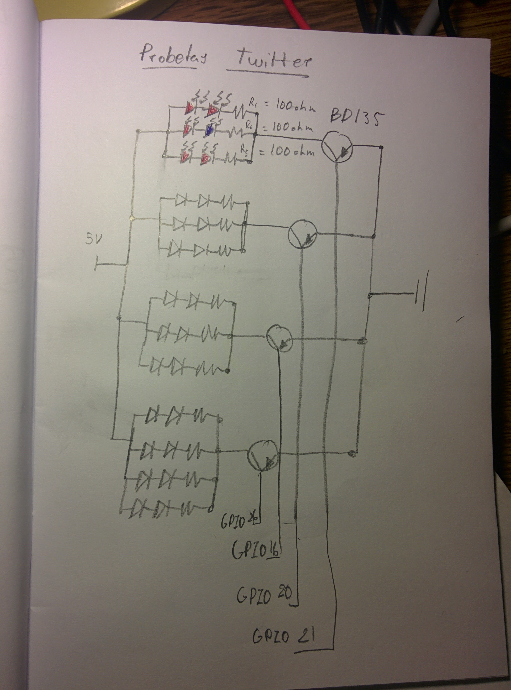

# Tweet4Life
Repositorio que aloja todo el código del proyecto "Tweet4Life" que es parte de la PyConES 2016. El experimento consiste en jugar con la vida de las plantas por medio de twitter, es decir, el espectador decide si la planta vive o muere.

La obra consta con cuatro plantas, y con cuatro luces (preparadas para dar luz artificial a la planta) conectadas a una raspberry pi. La raspberry pi se conecta a internet y mira 4 hastags, dependiendo de que hashtag tenga más tweets, se iluminará una u otra.

##Instalación
Primero de todo, antes de hacer fucionar el proyecto hay que crear la base de datos y todo el percal:

pi@raspberrypi:~ $ mysql -h localhost -u root -p
Enter password: 

create database TwitterDB;
use TwitterDB
CREATE TABLE TweeterData(Planta int, Value int);
INSERT INTO TweeterData VALUES(1,0);
INSERT INTO TweeterData VALUES(2,0);
INSERT INTO TweeterData VALUES(3,0);
INSERT INTO TweeterData VALUES(4,0);

CREATE TABLE LASTTWEET(Planta int, Tweet VARCHAR(140));
INSERT INTO LASTTWEET VALUES(1,'');
INSERT INTO LASTTWEET VALUES(2,'');
INSERT INTO LASTTWEET VALUES(3,'');
INSERT INTO LASTTWEET VALUES(4,'');

Ahora tienes que abrir el archivo setup.py que configurará la base de datos con el último tweet del hastag, si el script de Main.py da problemas (por culpa de la api de tweeter) tienes que echar a funcionar setup.py para refrescar la base de datos.

Si añades el script the Main.py al /etc/rc.local el script se correrá en segundo plano, para ver el output del script tienes que saber el PID de python (con "$ top") y ejecutar "sudo strace -p 1234" donde 1234 es el PID.

Para cambiar el Hastag, por defecto es #SalvarPrimera, #SalvarSegunda, #SalvarTercera, #SalvarTercera, etc., tienes que cambiar el archivo setup.py con el nuevo hastag, ejecutarlo, y luego modificar el archivo Main.py y ejecutarlo. (Lo malo es que se quedarán el numero de tweets del hastag anterior, con lo que deberias de meterte en el SQL para volverlo a poner a 0).

La electrónica del proyecto es:

| Componente        | Número           |
| ------------- |:-------------:|
| Raspberry PI  | x1 |
| Leds rojos      | x20      |
| Leds azules | x4     |
| Transistores BD135 | x4 |
| PCB | x1 |

El esquema electrónico quedaría tal que así:

Donde los transistores irian conectados a la raspberry pi.

##USO 
Para utilizarlo, tienes que conectar todo como pone anteriormente, y ejecutar los scripts anteriores. Para ejecutar todo tienes que hacer, "python Main.py" (en la carpeta del proyecto). Como he dicho anteriormente, si surge un problema ejecuta "python setup.py"

##Licencia
Este proyecto está licenciado bajo GPL v3

